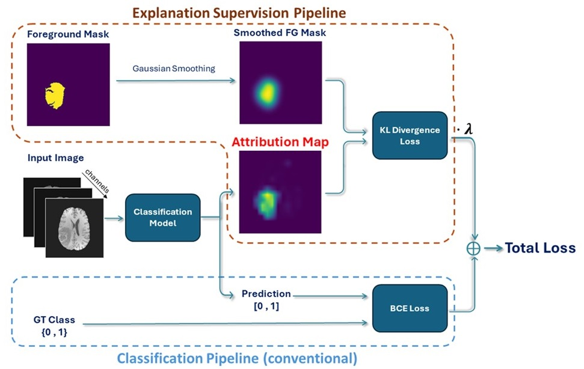
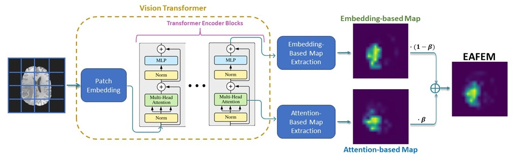

# LGM-ViT: Localization-Guided Medical Vision Transformer
The official implementation for the **ECCV 2024** eXCV Workshop paper: [_Localization-Guided Supervision for Robust Medical Image Classification by Vision Transformers_](https://link.springer.com/chapter/10.1007/978-3-031-92648-8_8).

## Abstract
A major challenge in developing data-driven algorithms for medical imaging is the limited size of available datasets. Furthermore, these datasets often suffer from inter-site heterogeneity caused by the use of different scanners and scanning protocols. These factors may contribute to overfitting, which undermines the generalization ability and robustness of deep learning classification models in the medical domain, leading to inadequate performance in real-world applications. To address these challenges and mitigate overfitting, we propose a framework which incorporates explanation supervision during training of ViT models for image classification. Our approach leverages foreground masks of the class object during training to regularize attribution maps extracted from ViT, encouraging the model to focus on relevant image regions and make predictions based on pertinent features. We introduce EAEFEM (Embedding-Attention Fused Explanation Map), a new method for generating explanatory attribution maps from ViT-based models and construct a dual-loss function that combines a conventional classification loss with a term that regularizes attribution maps. Our approach demonstrates superior performance over existing methods on two challenging medical imaging datasets, highlighting its effectiveness in the medical domain and its potential for application in other fields.

### LGM-ViT Framework:
<p align="center">
  
</p>

### EAFEM Extraction Process:
<p align="center">
  
</p>

## Binary Classification Performance
Results on the BraTS2020 and LiTS17 datasets.
The following results present the mean and standard deviation over three runs with different seeds:

> BraTS2020

|           Method            |    F1 Score     |    Accuracy     |      AUROC      |       AP        | Cohen's Kappa   | Weights                                                                                          |
|:---------------------------:|:---------------:|:---------------:|:---------------:|:---------------:|-----------------|--------------------------------------------------------------------------------------------------|
| Baseline (Vanilla ViT-B/16) |   89.5 ± 0.13   |   91.2 ± 0.19   |   96.7 ± 0.20   |   96.5 ± 0.15   | 81.9 ± 0.33     | [weights](https://drive.google.com/file/d/1tY3WuhSS5NUSM75VKZAV2Hj6XIM1drzm/view?usp=drive_link) |
|          GradMask           |   89.8 ± 0.24   |   91.4 ± 0.35   |   96.7 ± 0.12   |   96.6 ± 0.05   | 82.4 ± 0.65     | [weights](https://drive.google.com/file/d/1b6EoE0MnU49cDmnXy0ZykusCKKToCSqT/view?usp=drive_link) |
|          RobustViT          |   89.8 ± 0.36   |   91.3 ± 0.30   |   96.9 ± 0.04   |   96.8 ± 0.03   | 82.2 ± 0.61     | [weights](https://drive.google.com/file/d/1Qod-VzzAhySPrzI7qyB4Dv5jR81jsIby/view?usp=drive_link) |
|            RES-G            |   90.3 ± 0.58   |   91.8 ± 0.38   |   96.9 ± 0.43   |   96.8 ± 0.39   | 83.1 ± 0.84     | [weights](https://drive.google.com/file/d/1RbV-mhI4xWz5UJut8XVe510rshwsXPZl/view?usp=drive_link) |
|            RES-L            |   89.6 ± 0.30   |   91.1 ± 0.23   |   96.6 ± 0.04   |   96.6 ± 0.07   | 81.8 ± 0.48     | [weights](https://drive.google.com/file/d/1jDcdCKf8eWc0c_Z6k2m4lTu6YNa5qAYO/view?usp=drive_link) |
|        LGM-ViT(Ours)        | **91.4 ± 0.14** | **92.8 ± 0.14** | **97.3 ± 0.09** | **97.4 ± 0.07** | **85.3 ± 0.26** | [weights](https://drive.google.com/file/d/1HvVO9fvgMkqZXOHxLRtI5kw-X6UaW3NK/view?usp=drive_link) |

> LiTS17

|           Method            |    F1 Score     |    Accuracy     |      AUROC      |       AP        | Cohen's Kappa   | Weights                                                                                          |
|:---------------------------:|:---------------:|:---------------:|:---------------:|:---------------:|-----------------|--------------------------------------------------------------------------------------------------|
| Baseline (Vanilla ViT-B/16) |   79.1 ± 0.71   |   84.7 ± 1.39   |   93.3 ± 0.51   |   90.1 ± 1.08   | 67.0 ± 2.14     | [weights](https://drive.google.com/file/d/1xRUzcyX_9nLT5fbHziSTzjghhYrRyyfL/view?usp=drive_link) |
|          GradMask           |   81.6 ± 1.81   |   87.1 ± 1.58   |   93.7 ± 1.07   |   90.8 ± 1.44   | 71.7 ± 3.13     | [weights](https://drive.google.com/file/d/1DxlY_Z6jg8ISiH4i7-f76BxcV26cfOE3/view?usp=drive_link) |
|          RobustViT          |   80.2 ± 0.32   |   86.6 ± 0.11   |   93.3 ± 0.34   |   89.8 ± 0.33   | 70.0 ± 0.34     | [weights](https://drive.google.com/file/d/1hH_SHSfKI_kz3T7UGOXTlbyWEC4rTBg1/view?usp=drive_link) |
|            RES-G            |   82.0 ± 1.58   |   87.4 ± 1.16   |   94.0 ± 0.97   |   90.1 ± 1.56   | 72.3 ± 2.48     | [weights](https://drive.google.com/file/d/1V-_q5c_4oWhro6bjFgZB-NUHLeGckeBO/view?usp=drive_link) |
|            RES-L            |   80.3 ± 2.18   |   85.5 ± 1.58   |   92.6 ± 1.68   |   88.1 ± 3.77   | 68.8 ± 3.34     | [weights](https://drive.google.com/file/d/11SBH2zvHKCM0ym_qDgHAPibwWcrj2mOS/view?usp=drive_link) |
|        LGM-ViT(Ours)        | **88.8 ± 0.57** | **92.2 ± 0.56** | **97.2 ± 0.24** | **96.0 ± 0.22** | **82.8 ± 1.07** | [weights](https://drive.google.com/file/d/1LDMnz7dK1Gc4UVDk7Xwj5Ibp5oKfOppf/view?usp=drive_link) |


## Environment Setup
### Create environment

Using conda:
```
conda create -n lgmvit python=3.9
conda activate lgmvit
```

### Install packages
```
pip install -r requirements.txt
```
or:
```
pip install torch==2.2.0 torchvision==0.17.0 torchaudio==2.2.0
pip install SimpleITK-SimpleElastix
pip install easydict==1.11 pyyaml==6.0.1 scipy==1.12.0 opencv-python==4.9.0.80 torchmetrics==1.3.0 einops==0.7.0 timm==0.9.12 pandas==2.2.0 tabulate==0.9.0 wandb==0.16.3
```

## Data Preparation
Download the following datasets and extract them to the same parent directory:
- [BraTS2020](https://www.kaggle.com/datasets/awsaf49/brats20-dataset-training-validation?resource=download)
- [LiTS17](https://competitions.codalab.org/competitions/17094)

The data should be organized in the following structure:
```
 |-- datasets_parent_directory
     |-- BraTS2020
         |-- MICCAI_BraTS2020_TrainingData
            |-- BraTS20_Training_001
               -- BraTS20_Training_001_flair.nii
               -- BraTS20_Training_001_seg.nii
               -- BraTS20_Training_001_t1.nii
               -- BraTS20_Training_001_t1ce.nii
               -- BraTS20_Training_001_t2.nii
            |-- BraTS20_Training_002
            |-- BraTS20_Training_003
            ...
            |-- BraTS20_Training_369
     |-- LiTS17
         |-- scans
            -- volume-0.nii
            -- volume-1.nii
            -- volume-2.nii
            ...
            -- volume-130.nii
         |-- segmentations
            -- segmentation-0.nii
            -- segmentation-1.nii
            -- segmentation-2.nii
            ...
            -- segmentation-130.nii
```
Define the path to your datasets parent directory in all configuration files inside the repository's `config` directory under the attribute 'DATA.DATASET_DIR':
```
DATA:
   DATASET_DIR: /path/to/datasets/parent/directory/
   ...
   ...
TRAINING:
   ...
   ...
MODEL:
   ...
   ...
DISTRIBUTED:
   ...
   ...
```

The training sets of both datasets were randomly divided into train-validation-test sets. The sets are defined in `datasets/data_splits`.

## Training
Define the output path to the parent directory in which all the experiments (checkpoints) will be saved by changing the 'TRAINING.OUTPUT_DIR'
attribute in all configuration files inside the repository's `config` directory:
```
DATA:
   ...
   ...
TRAINING:
   OUTPUT_DIR: /path/to/outputs/parent/directory/
   ...
   ...
MODEL:
   ...
   ...
DISTRIBUTED:
   ...
   ...
```
### BraTS2020
To train on the BraTS2020 dataset run the following command:
```
python train.py LGMViT_brats20 -d brats20 --use_wandb --wandb_proj_name LGMViT_brats20 --seed 42
```

### LiTS17
To train on the LiTS17 dataset run the following command:
```
python train.py LGMViT_lits17 -d lits17 --use_wandb --wandb_proj_name LGMViT_lits17 --seed 42
```
To train the baseline model (vanilla ViT-B/16 model) or a customized configuration
replace the first argument with the name of the desired model config under `configs/brats20` for BraTS2020 and `configs/lits17` for LiTS17. We use [W&B](https://github.com/wandb/client) to log our training experiments, to disable W&B loging remove `--use_wandb`.

## Evaluation
Download the model weights from [Google Drive](https://drive.google.com/drive/folders/1Ru-bqF5_JVYllrdWkzrU5P1PqAKLtZS1?usp=drive_link)  (or directly from the tables above).
### BraTS2020
To run evaluation on the BraTS2020 test set run the following command:
```
python test.py LGMViT_brats20 -d brats20 -c best
```
`-c` defines the checkpoint (model's weights) to load. Options: 
- "best" (loads the best epoch saved during training).
- Number of type int (loads a specific checkpoint by number). Example `-c 20`.
- Full path to checkpoint.

For the first two options the models weights (trained or downloaded) should be located at:
```
 |-- TRAINING.OUTPUT_DIR
     |-- *dataset name*
         |-- *config name*
            |-- ckpt
                -- model_weights_file
 ```
Where TRAINING.OUTPUT_DIR is the directory defined in the chosen configuration file, *dataset name* is the name of the dataset you are running (brats20 or lits17), and *config name* is the name of the configuration file you are running.

To run evaluation on multiple configurations insert the names of the config files one after the other, and insert a checkpoint for each config in the same order of the config file names (or insert `best` if you want to load the best epoch saved during training for all configurations):
```
python test.py ViT_B16_baseline_brats20 LGMViT_brats20 LGMViT_brats20_2 -d brats20 -c best
```
Example for different checkpoint options: 
- `-c best`, 
- `-c 20 best 25`, 
- `-c /full_path_to_checkpoint_of_first_model /full_path_to_checkpoint_of_second_model /full_path_to_checkpoint_of_third_model`, 
### LiTS17
To run evaluation on the LiTS17 test set run the following command:
```
python test.py LGMViT_lits17 -d lits17 -c best
```

To run evaluation on multiple configurations:
```
python test.py ViT_B16_baseline_lits17 LGMViT_lits17 LGMViT_lits17_2 -d lits17 -c best
```

## Competing Methods
To train the competing methods (GradMask, RES, and RobustVit) use the  `competing_methods` branch. Evaluation for the competing methods can be executed on the master branch (since all changes are applied to the training pipeline).

## Acknowledgments
Our code is partly based on the [DETR](https://github.com/facebookresearch/detr)
and [VisTR](https://github.com/YuqingWang1029/VisTR) repositories. We would like to thank the authors for their great work.

## Citation
If our work is useful for your research, please consider citing:

```Bibtex
@inproceedings{ben2025localization,
  title={Localization-Guided Supervision for Robust Medical Image Classification by Vision Transformers},
  author={Ben Itzhak, Sagi and Kiryati, Nahum and Portnoy, Orith and Mayer, Arnaldo},
  booktitle={European Conference on Computer Vision},
  pages={118--133},
  year={2025},
  organization={Springer}
}
```

